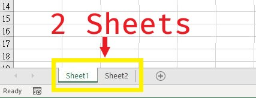
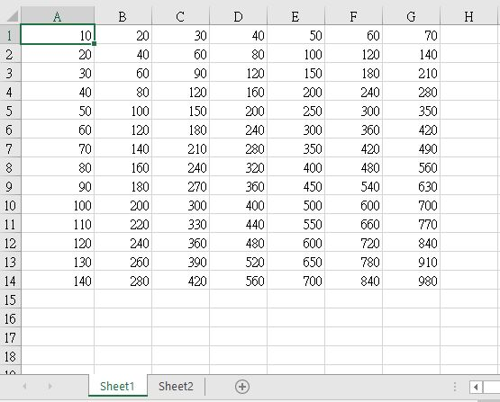
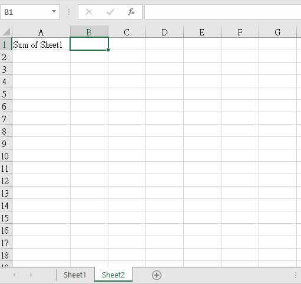
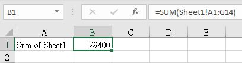
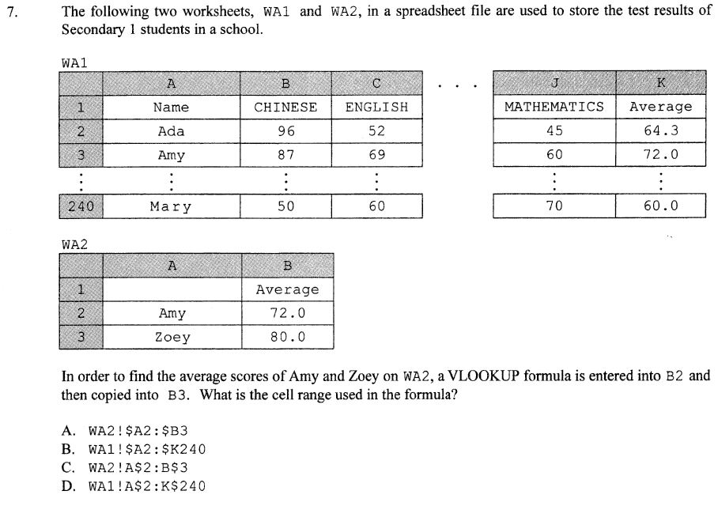

# Spreadsheet (Excel) Formula Summary Table

## Content

* [Spreadsheet (Excel) Formula Summary Table](#spreadsheet-excel-formula-summary-table)
  + [Content](#content)
  + [Operators](#operators)
    - [Arithmetic Operator](#arithmetic-operator)
    - [Comparison Operator](#comparison-operator)
    - [Text Operator](#text-operator)
  + [Functions](#functions)
    - [Statistical Function](#statistical-function)
    - [Mathematical Functions](#mathematical-functions)
    - [Logical Functions](#logical-functions)
    - [Text, Date and Time Functions](#text-date-and-time-functions)
    - [Lookup and Reference Functions](#lookup-and-reference-functions)
  + [Syntax between different sheets](#syntax-between-different-sheets)

## Operators

### Arithmetic Operator

| Operator            |        Description        | Notes                  |
|---------------------|:-------------------------:|------------------------|
| `+` (Plus sign)     |         Addition          | NULL                   |
| `-` (Minus sign)    | Subtraction   Negation | NULL                   |
| `*` (Asterisk)      |      Multiplication       | NULL                   |
| `/` (Forward slash) |         Division          | NULL                   |
| `%` (percent sign)  |          Percent          | **Not Given in HKDSE** |
| `^` (caret)         |      Exponentiation       | **Not Given in HKDSE** |

### Comparison Operator

| Operator                             |       Description        | Notes |
|--------------------------------------|:------------------------:|-------|
| `<` (Less than sign)                 |        Less than         | NULL  |
| `>` (Greater than sign)              |       Greater than       | NULL  |
| `=` (Equal sign)                     |         Equal to         | NULL  |
| `<>` (Not equal to sign)             |       Not equal to       | NULL  |
| `<=` (Less than or equal to sign)    |  Less than or equal to   | NULL  |
| `>=` (Greater than or equal to sign) | Greater than or equal to | NULL  |

### Text Operator

| Operator        |                                 Description                                 | Notes                                             |
|-----------------|:---------------------------------------------------------------------------:|---------------------------------------------------|
| `&` (ampersand) | Connects, or concatenates, two values to produce one continuous text value. | Somehow works similar with function `CONCATENATE` |

## Functions

### Statistical Function

| Function   | Description                                                                    | Formula                     | Explanation/Note                                                                                               |
|------------|--------------------------------------------------------------------------------|-----------------------------|----------------------------------------------------------------------------------------------------------------|
| MAX        | Finds the maximum value of a range of cells.                                   | `=MAX(Range)` | NULL                                                                                                           |
| MIN        | Finds the minimum value of a range of cells.                                   | `=MIN(Range)` | NULL                                                                                                           |
| AVERAGE    | Finds the average numerical value of a range of cells.                         | `=AVERAGE(Range)` | NULL                                                                                                           |
| COUNT      | Finds the number of cells containing numerical data.                           | `=COUNT(Range)` | NULL                                                                                                           |
| COUNTA     | Counts the number of cells that are not empty in a range.                      | `=COUNTA(Range)` | More than 1 Range can be added.                                                                                |
| COUNTBLANK | Count the number of empty cells in a range of cells.                           | `=COUNTBLANK(range)` | Cells with formulas that return "" (empty text) are also counted.   Cells with zero values are not counted. |
| COUNTIF    | Counts the number of cells which contain data fulfilling a specific condition. | `=COUNTIF(Range,Condition)` | NULL                                                                                                           |
| LARGE      | Finds the *n*th largest value within the given range of cells.                 | `=LARGE(Range,n)` | **Not Given in HKDSE**  =LARGE(Range, 1) is equal to =MAX(Range)                                            |
| SMALL      | Finds the *n*th smallest value within the given range of cells.                | `=SMALL(Range,n)` | **Not Given in HKDSE**  =SMALL(Range, 1) is equal to =MIN(Range)                                            |
| MODE       | Finds the mode of the set of data given.                                       | `=MODE(RANGE)` | **Not Given in HKDSE**                                                                                         |

### Mathematical Functions

| Function | Description                                                                                                                  | Formula                                       | Explanation/Note                                                                                                                                                                                                                                                       |
|----------|------------------------------------------------------------------------------------------------------------------------------|-----------------------------------------------|------------------------------------------------------------------------------------------------------------------------------------------------------------------------------------------------------------------------------------------------------------------------|
| ABS      | Returns the absolute value of a number.                                                                                      | `=ABS(Number)` | NULL                                                                                                                                                                                                                                                                   |
| SQRT     | Returns a positive square root.                                                                                              | `=SQRT(Number)` | If number is negative, SQRT returns the #NUM! error value.                                                                                                                                                                                                             |
| SUM      | Finds the sum of the numeric data in the range given.                                                                        | `=SUM(Range)` | NULL                                                                                                                                                                                                                                                                   |
| SUMIF    | Finds the sum of the values within the *sum range* if the corresponding entries in the *cell range* fit the condition given. | `=SUMIF(Range (Cell),Condition, Range (Sum))` | The formula looks up each cell in the *cell range* consecutively, then applies *condition* to it.  If *condition* return true, the corresponding value in the *sum range* is added to the current total.  The total is then the result of the formula.           |
| ROUND    | Rounds the value *Number* to the specified number *Num_digits* of decimal places.                                                          | `=ROUND(Number,Num_digits)` | If Num_digits is greater than 0 , then Number is rounded to the specified (Num_digit) decimal places.   If num_digits is 0, the number is rounded to the nearest integer.  If num_digits is less than 0, the number is rounded to the left of the decimal point.                                                                                                                                                                                                                                                                   |
| INT      | Rounds down (casts) the value given to an integer.                                                                           | `=INT(Number)` | NULL                                                                                                                                                                                                                                                                   |
| MOD      | Finds the remainder (mod) of the division between number *n* and dividend *p*.                                               | `=MOD(n,p)` | **Not Given in HKDSE**  =MOD(9, 2) = 1                                                                                                                                                                                                                              |
| POWER    | Returns the value of the base *n* to the power *p*.                                                                          | `=POWER(N,P)` | **Not Given in HKDSE**  =POWER(3, 2) = 9                                                                                                                                                                                                                            |
| RAND     | Generates a random decimal within the range 0<=x<1.                                                                          | `=RAND()` | To scale the number to between 0 to *x*, use = x * RAND().  To scale the number to between *y* and *z*, use = (z - y) * RAND() + y                                                                                                                                  |
| RANK     | Returns the rank of a number in a list of numbers.                                                                           | `RANK(Number,Range,[Order])` | Order is Optional  (i.e., 0 for descending order and 1 for ascending order)                                                                                                           

### Logical Functions

| Function | Description                                                         | Formula                             | Explanation/Note                     |
|----------|---------------------------------------------------------------------|-------------------------------------|--------------------------------------|
| IF       | Returns *a* if the condition given is true, *b* otherwise.          | `=IF(Condition,a,b)` | NULL                                 |
| AND      | Returns true if all the conditions given are true, false otherwise. | `=AND(Condition_1,Condition_2,...)` | More than 2 conditions can be added. |
| OR       | Returns true if any condition given is true, false otherwise.       | `=OR(Condition_1,Condition_2,...)` | More than 2 conditions can be added. |
| NOT      | Returns false if the condition given is true, false otherwise.      | `=NOT(Condition)` | NULL                                 |
| ISBLANK  | Returns true if the cell is empty, false otherwise.                 | `=ISBLANK(Cell)` | NULL                                 |

### Text, Date and Time Functions

| Function    | Description                                                                                                         | Formula                                 | Explanation/Note                                                                                           |
|-------------|---------------------------------------------------------------------------------------------------------------------|-----------------------------------------|------------------------------------------------------------------------------------------------------------|
| CODE        | Returns the ASCII key code of the first character in a string.                                                      | `=CODE(String)` | **Not Given in HKDSE**                                                                                  |
| CONCATENATE | Join two or more text strings into one string                                                                       | `=CONCATENATE(String1, [String2], ...)` | String2 (and more) are optional.  You can have up to 255 items, up to a total of 8, 192 characters.     |
| CHAR        | Returns the ASCII character as specified by the key code given.                                                     | `=CHAR(Number)` | NULL                                                                                                       |
| LEN         | Returns the length (number of characters) of a string.                                                              | `=LEN(String)` | NULL                                                                                                       |
| LEFT        | Returns the leftmost *n* characters in the string provided.                                                         | `=LEFT(String,n)` | =LEFT("I IS MR WONG", 3) = "I I"                                                                           |
| MID         | Returns a *n* characters from the string given, starting from the *p*th character.                                  | `=MID(String,n,p)` | =MID("I IS MR WONG", 3, 4) = "IS M"                                                                        |
| RIGHT       | Returns the rightmost *n* characters in the string provided.                                                        | `=RIGHT(String,n)` | =RIGHT("I IS MR WONG", 3) = "ONG"                                                                          |
| TEXT        | Returns the textual representation of the number given.                                                             | `=TEXT(Number)` | =TEXT(133)= "133"   (can also work wth dates, e.g. =TEXT(12-6-2017, "dd-mmmm-yyyy") =12-June-2017)      |
| TRIM        | Removes all spaces from text except for single spaces between words.                                                | `=TRIM(String)` | NULL                                                                                                       |
| UPPER       | Converts text to uppercase.                                                                                         | `=UPPER(String)` | NULL                                                                                                       |
| LOWER       | Converts all uppercase letters in a text string to lowercase.                                                       | `=LOWER(String)` | NULL                                                                                                       |
| VALUE       | Returns the numerical representation of a piece of text.                                                            | `=VALUE(String)` | =VALUE("133") = 133                                                                                        |
| PROPER      | Capitalizes the first letter in a text string and converts all other letters in the same word to lowercase letters. | `=PROPER(String)` | NULL                                                                                                       |
| DAY         | Returns the day of the Date given.                                                                                  | `=DAY(Date)` | **Not Given in HKDSE**  =DAY(31/12/2077) = 31                                                           |
| MONTH       | Returns the month of the Date given.                                                                                | `=MONTH(Date)` | **Not Given in HKDSE**  =MONTH(31/12/2077) = 12                                                         |
| YEAR        | Returns the year of the Date given.                                                                                 | `=YEAR(Date)` | **Not Given in HKDSE**  =YEAR(31/12/2077) = 2077                                                        |
| WEEKDAY     | Finds the day of the week of this Date, in a numeric form.                                                          | `=WEEKDAY(Date)` | **Not Given in HKDSE**  1 = Sunday, 2 = Monday, 3 = Tuesday, ..., 7 = Saturday (=WEEKDAY(6/1/2021) = 4) |
| TODAY       | Finds the current day.                                                                                              | `=TODAY()` | **Not Given in HKDSE**                                                                                     |

### Lookup and Reference Functions

| Function | Description                               | Formula                              | Explanation/Note                                                                                                                                                                                                                                                                                                              |
|----------|-------------------------------------------|--------------------------------------|-------------------------------------------------------------------------------------------------------------------------------------------------------------------------------------------------------------------------------------------------------------------------------------------------------------------------------|
| HLOOKUP  | Looks up data according to a given value. | `=HLOOKUP(n, Range, p, Approximate)` | **Not Given in HKDSE**  Horizontally looks for the value *n* in the first row of the range given.  If *Approximate* is true, a comparison is used to find the most matching data.  Otherwise, only equal results will count as a success.  When the value is found, looks *p* cells down for the value to return. |
| VLOOKUP  | Looks up data according to a given value. | `=VLOOKUP(n, Range, p, Approximate)` | Vertically looks for the value *n* in the first row of the range given.  If *Approximate* is true, a comparison is used to find the most matching data.  Otherwise, only equal results will count as a success.  When the value is found, looks *p* cells to the right for the value to return.                      |

## Syntax between different sheets

Under the same spreadsheet document, all the cells are transferable between different sheets. Here is and example of a spreadsheet with 2 sheets\

\
The formula to connect 2 different sheets is `{Sheet_Name}!` . It may a bit confusing by looking at the formula so look at the example below

> Note: the follow example can be find in `assets/Excel/Example.xlsx`

Here are some values in the cells of `Sheet1` \

\
Our mission is to sum up all the values in `Sheet1` in the cell `B1` of `Sheet2` \

\
To sum Sheet1, we will use `=SUM(Sheet1!A1:G14)` in this case.\

\
**Note: In this example the name the sheet is `Sheet1` , remember to change to the correct sheet name it give to you in exam**\
For example in 2013 DSE Paper 1 Question 7, it given 2 sheet named `WA1` and `WA2` \

